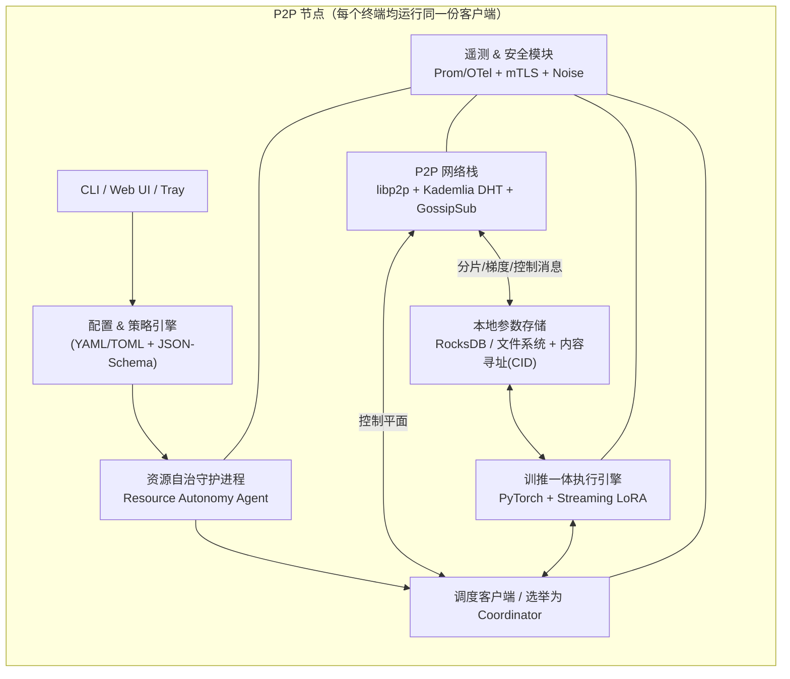
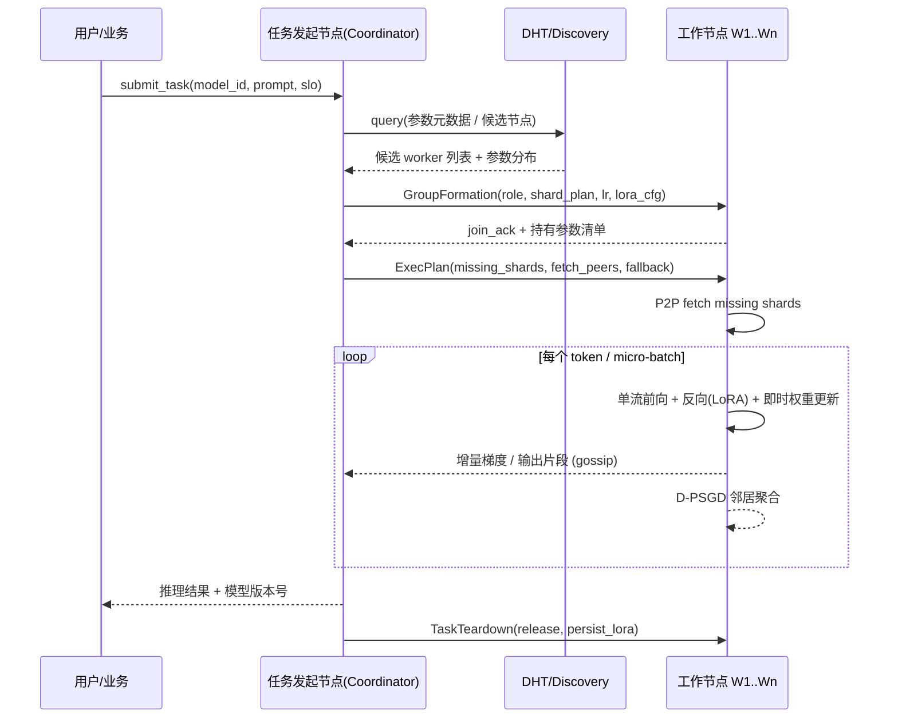

# P2PAI

基于 P2P 网络的分布式 AI 推理训练一体化架构

> 本仓库提供两份核心文档：
> - 本 `README.md`：架构总体设计 + 可工程落地的技术实施方案
> - [`REQUIREMENTS.md`](./REQUIREMENTS.md)：项目需求规格说明书（PRD/SRS）

---

# 基于 P2P 网络的分布式 AI 推理训练一体化架构技术文档

## 1 摘要

本文档提出一套**基于互联网 P2P 去中心化组网、用户资源自治、原生单流训推一体、动态节点群组、参数缺损自适应容错**的分布式 AI 协同计算架构。本架构彻底突破传统 AI 系统“训练推理割裂、中心化部署、参数静态分配、集群拓扑固定”的固有范式，依托全网异构终端闲置算力，支持模型参数**全网随机离散散落分布**，可根据业务任务需求实现节点动态临时成组、拓扑弹性伸缩。

架构创新性引入大模型**全息信息弥散、分形自相似**内生底层特性，结合**参数敏感性分级管控与高敏感参数本地常驻机制**，系统性解决无序组网场景下参数缺失、传输错误、跨组动态替换、散乱参数重组导致的训推不稳定问题。全程由任务发起节点临时承担全局调度职责，通过 P2P 网络完成参数分片增量流转、自适应归集与实时同步更新，同时赋予用户本地算力、网络、功耗资源最高自主管控权限。

本架构在算子层级实现**推理过程实时迭代模型参数**的原生训推一体能力，可在参数随机散落、节点自由进退、网络拓扑动态变更的复杂互联网工况下，维持稳定的推理服务与增量训练闭环。整体具备低成本、高隐私、强容错、强异构适配、无限弹性扩展的核心优势，适用于大模型轻量化在线迭代、边缘 AI 协同计算、全域分布式算力网络、企业私有化算力集群、实时场景动态模型优化等多类落地场景。

## 2 技术背景

### 2.1 现有技术缺陷

1. **训推架构物理割裂、伪一体普遍存在**：传统 AI 架构严格区分离线集中训练、在线固定参数推理两套独立体系，无法利用推理阶段真实业务数据实时优化模型，迭代滞后、场景适配性差。市面多数标称“训推一体”的方案仅为双线程双线并行，推理链路参数固定、训练异步滞后更新，属于形式化伪一体，未实现底层计算流融合。

2. **中心化调度成本高昂、资源利用率低**：传统智算中心采用中心化调度与固定集群部署模式，硬件堆叠扩容成本极高，无法盘活海量民用终端闲置 CPU、GPU 与带宽资源，全域算力资源浪费严重，规模化落地门槛高。

3. **中心化传输存在瓶颈、组网拓展性受限**：模型权重、梯度增量数据依赖中心服务器统一中转，存在明显带宽瓶颈与高时延问题，大规模分布式组网下极易出现拥堵、掉线、任务中断，且存在单点故障风险。

4. **用户资源无自治权限、参与度低**：现有分布式算力系统强制占用终端资源，未预留用户自定义管控权限，用户无法自主限制算力、带宽、功耗与任务类型，前台业务优先级无法保障，大众节点参与意愿低，难以实现互联网级规模化组网。

5. **组网与参数分配模式僵化、容错能力薄弱**：现有分布式训推架构均采用**静态参数分片、预设节点参数归属、固定集群拓扑**的设计，无法适配互联网节点不稳定、自由进退、动态组网的特征。在参数随机散落、动态群组重组场景下，极易出现参数缺失、传输错误、多源参数替换扰动，引发推理失效、训练梯度发散、模型劣化崩塌。

6. **理论研究与工程落地脱节**：当前学术界已验证大模型具备全息信息弥散、分形自相似的内生结构特性，同时参数敏感性、分布式故障容错相关研究日趋成熟，但暂无方案将三类理论深度融合，并落地于去中心化随机参数训推场景，理论价值长期无法实现工程转化。

### 2.2 本架构核心解决问题

1. 从底层算子与计算流水线层面，构建**原生单流训推一体**架构，消除训练、推理双链路割裂问题，实现推理全过程实时动态迭代模型参数。

2. 构建**任务驱动的动态节点群组体系**，支持节点按需临时组网、弹性扩缩、自由退网，适配互联网异构无序节点生态，打破固定集群拓扑限制。

3. 依托大模型**全息弥散、分形自相似**内生特性，从信息论与数学底层解决参数随机分布场景下，参数缺失、错误、跨组替换、散乱重组带来的训推稳定性难题。

4. 建立**参数敏感性三级分级管控 + 高敏感参数本地常驻**机制，从根源规避核心参数丢失风险，平衡系统稳定性与全网闲置算力利用率。

5. 采用纯 P2P 去中心化传输组网，摆脱中心节点带宽瓶颈与单点故障，实现参数分片点对点增量流转、动态归集与跨组重组。

6. 落地**用户全维度资源自治体系**，用户资源配置优先级高于系统调度策略，全面保障终端设备使用安全与前台业务优先。

7. 构建**无序参数自适应容错重组范式**，实现参数永久随机散落、动态组网场景下的稳定训推闭环，填补相关技术与理论应用空白。

## 3 架构总体设计

### 3.1 核心设计理念

本架构基于理论创新与工程落地双重维度，确立七大核心设计准则，全方位适配互联网去中心化、异构、动态、无序的组网特征：

1. **原生单流训推一体**：底层统一单计算流架构，算子层级深度融合推理与参数迭代流程，实现推理即训练、推理即参数实时演化，杜绝伪一体设计。

2. **多驱动智能动态调度**：以业务场景、终端硬件资源、节点在线稳定性三重维度为依据，实现全网自适应、差异化任务调度。

3. **全息 + 分形理论底层赋能**：依托 Transformer 大模型内生的信息全息冗余、结构分形自相似特性，作为参数缺损、重组、动态替换的容错理论基石。

4. **动态群组 + 无序参数适配**：兼容节点动态临时成组、参数全网随机散落分布，不依赖静态分片规划与固定拓扑结构。

5. **参数分级容错管控**：基于参数敏感性量化差异，制定 S1/S2/S3 三级差异化存储、冗余、流转、容错策略。

6. **用户资源自治优先**：用户本地算力、带宽、功耗、任务权限自主可控，配置优先级高于全网调度策略。

7. **P2P 去中心化协同**：全网节点平等组网、点对点传参，无固定中心服务节点，由任务发起节点临时统筹全局工作。

### 3.2 整体层级架构

本架构自下而上采用四层解耦设计，层级边界清晰、接口独立、协同联动，兼顾独立性与整体性：

1. **用户资源自治层（基础底层）**：负责本地硬件资源全自动探测、用户自定义规则配置、资源隔离与超限熔断防护，生成标准化终端资源画像与动态稳定性评分，为上层智能调度提供精准数据支撑。

2. **P2P 网络传输层**：基于 DHT 分布式哈希表、Libp2p 协议实现去中心化网状组网，支持跨防火墙、跨网段、跨 NAT 设备穿透；完成参数分片、增量梯度数据的点对点加密传输、断点续传、防篡改校验，支撑跨节点、跨群组参数动态流转与归集重组。

3. **分布式原生训推计算层（核心业务层）**：采用单流统一计算范式，实现推理与实时参数更新深度融合；依托模型全息分形内生特性，完成散乱参数自适应重组、残缺容错计算、动态参数替换适配，执行分片本地训推与去中心化异步梯度聚合。

4. **全局任务调度层（统筹管理层）**：由任务发起节点临时担任调度主体，负责全网资源与稳定性采集、动态节点成组管理、参数元数据盘点、分级任务分配、节点心跳监测、异常容错与全生命周期任务管控，仅下发调度指令，不参与数据与参数中转。

### 3.3 架构核心特性

1. **原生单流训推一体化**：摒弃传统双线并行伪一体架构，算子级深度融合计算流程，推理执行过程中实时完成权重迭代，实现真实同步训推。

2. **全网参数随机分布兼容**：无需预设参数存储节点、无需固定分片归属，模型权重全域随机散落，依靠元数据标识与逻辑寻址完成全局调度。

3. **任务驱动动态成组**：按需组建临时任务群组，群组生命周期与任务绑定，任务结束自动解散，节点、参数资源回归全网资源池，弹性伸缩无约束。

4. **全息分形内生容错能力**：依托大模型信息全息弥散、结构分形自相似特性，天然适配参数残缺、重组、动态替换的复杂计算工况。

5. **三级参数分级容错管控**：区分高、中、低敏感参数，差异化配置常驻存储、冗余备份、流转策略、容错机制，兼顾稳定性与资源效率。

6. **去中心化 P2P 低时延传输**：点对点增量传参，大幅降低带宽消耗与传输时延，无中心瓶颈、无单点故障。

7. **全维度用户资源自治**：算力、带宽、功耗、任务权限全自定义，前台业务优先级最高，设备安全可控。

8. **强异构高容错适配**：兼容高低配终端、稳定/弱网波动各类异构节点，节点自由进退、参数局部缺损不引发全局任务崩溃。

### 3.4 系统组件全景图



## 4 各模块详细设计

### 4.1 用户资源自治层

#### 4.1.1 核心功能

1. **本地资源全自动探测**：实时采集终端 CPU 核心数、GPU 显存、内存容量、上下行带宽、设备在线时长、功耗上限，生成标准化**终端资源画像**；持续监测节点在线稳定性、网络波动情况，输出动态稳定性评分，轻量化上报至调度主节点。

2. **用户自定义配置体系**：用户自主制定全部资源使用规则，所有配置优先级高于系统调度策略，可灵活适配不同设备、不同使用场景：

- 算力限制：自定义最大 CPU 占用核数、GPU 显存占用上限、整体算力使用率阈值；

- 网络限制：设置上下行带宽限额、支持仅 WiFi 运行、禁用移动流量、夜间静默调度模式；

- 任务权限：可选择仅开启推理、仅参与轻量训练、训推全开、拒绝高负载复杂任务；

- 安全限制：支持资源占用超限自动熔断、设备离线强制退出、后台任务暂停保护机制。

3. **本地资源隔离机制**：架构占用的算力、内存、网络资源与用户前台应用严格物理隔离，系统资源调度优先级低于用户业务，绝不抢占设备正常使用资源，保障用户使用体验不受影响。

#### 4.1.2 工作逻辑

用户规则配置 → 本地策略固化生效 → 全维度资源实时监测 → 负载超限自动熔断防护 → 轻量化资源画像与稳定性数据上报调度层。

### 4.2 P2P 网络传输层

#### 4.2.1 核心功能

1. **去中心化网状组网**：基于 Libp2p + DHT 分布式哈希表构建无中心全网网状拓扑，无需专属服务器支撑，支持跨防火墙、跨网段、跨 NAT 设备穿透组网，节点平等入网、自由退网。

2. **模块化参数分片 P2P 传输**：将完整大模型拆解为可独立调度、可拆分重组的模块化参数分片，支持多源并行分片下载、增量梯度定向传输、加密通信、断点续传、分片哈希防篡改，优先传输增量更新数据，大幅降低带宽消耗。

3. **跨节点/跨群组参数动态流转**：支持所有参数分片在任意节点、临时任务组之间自由迁移、归集、复用；依托标准化元数据标签，实现无序参数的跨域调度、版本对齐与重组适配。

#### 4.2.2 传输规则

1. 模型初始分片：采用 P2P 多节点并行下载模式，提速本地模型初始化加载；

2. 训练增量更新：本地完成梯度计算后，P2P 异步上传增量参数至全网邻居节点，无需传输完整权重；

3. 所有传输行为严格遵从用户自定义带宽上限，杜绝超额占用网络资源。

### 4.3 分布式原生训推计算层（核心创新层）

#### 4.3.1 真伪训推一体架构对比

行业传统方案普遍为**双链路隔离伪一体架构**：独立推理链路采用固定静态参数保障低时延，后台配置单独训练链路异步更新权重，推理全程参数无变化，参数更新严重滞后，两套计算流相互割裂，无法实现实时场景自适应迭代。

本架构基于**在线学习、流式持续学习、推理时动态权重迭代**范式，构建**单条统一计算流**，实现原生真训推一体：前向推理计算过程中，同步完成梯度求解、权重修正、参数实时迭代，推理输出与参数更新同源同步；针对大模型场景嵌入 Streaming LoRA 自适应机制，在 Token 生成链路中动态更新增量参数，实现主权重与适配参数同步演化，前向算子与梯度修正算子深度融合，从底层消除双链路割裂缺陷。

| 架构类型 | 计算流形态 | 参数变更时机 | 迭代特性 |
| --- | --- | --- | --- |
| 传统双线伪一体 | 推理、训练双链路隔离 | 后台异步滞后更新，推理全程参数固定 | 迭代延迟、场景适配能力弱 |
| 本架构原生一体 | 单流统一计算、算子深度融合 | 推理执行过程中实时动态改参 | 实时迭代、场景即时自适应 |

#### 4.3.2 底层理论支撑：大模型全息与分形内生特性

本架构突破传统纯工程容错思路，依托 Transformer 大模型天然具备的**全息信息弥散、分形自相似**底层特性，为参数随机散落、残缺重组、动态替换下的稳定训推提供数学与信息论支撑。

##### 4.3.2.1 全息信息弥散特征

大模型语义、语法、事实知识并非集中存储于局部专属参数，而是**全息式弥散分布于全域权重矩阵与各网络层**；各网络层、注意力头、局部参数分片具备极强信息冗余，局部碎片可承载全局核心信息。少量参数缺失、错误、局部替换仅造成精度轻度降级，不会引发全局信息崩塌；碎片化参数经归集重组后，可依托冗余信息重构完整推理计算链路，天然适配无序参数组网场景。

##### 4.3.2.2 分形自相似结构特征

Transformer 层级堆叠结构具备**递归分形嵌套特性**，子模块与主干网络、局部结构与整体模型具备强自相似性；模型权重服从分形幂律分布，天然形成“少数高敏感核心权重 + 大量普通容错权重”的层级分化。任意子模块可独立拆分、迁移、跨组重组，结构自洽且可完成轻量化计算；动态临时节点组具备全局网络的缩微分形特征，可独立完成本地化训推闭环，支撑架构无限伸缩扩展。

#### 4.3.3 分布式计算通用逻辑

1. 单节点独立完成所持参数分片的**单流推理 + 实时参数迭代**，兼顾推理服务可用性与模型增量优化；

2. 全网多节点分片并行推理，聚合输出完整推理结果；通过去中心化异步梯度聚合算法（D-PSGD），无需全局同步，兼容异构节点算力差异与参数扰动，完成全局模型迭代更新；

3. 依托全息冗余与分形自洽特性，自适应适配参数残缺、跨组重组、动态替换等异常工况，保障计算链路稳定。

### 4.4 全局任务调度层（任务发起节点独有）

#### 4.4.1 节点角色定义

全网普通节点仅承担资源上报、P2P 传参、本地训推计算基础职责；任意普通节点发起 AI 训推任务后，自动晋升为**本轮任务专属调度主节点**，独享全局调度权限，任务结束后权限自动回收，全程无固定中心服务节点。

#### 4.4.2 基础调度功能

1. **全网状态全域采集**：汇总所有在线节点的资源画像、用户配置约束、在线时长、网络状态、动态稳定性评分，构建全域资源视图；

2. **场景化差异化任务分配**：结合业务场景、模型参数敏感等级、节点算力与稳定性，差异化分配任务分片，实现算力与任务精准匹配；

3. **任务全生命周期管控**：负责任务下发、节点心跳监测、离线异常节点剔除、失败分片重分配、全局结果聚合；

4. **无数据中转调度**：调度节点仅下发调度指令、统筹全局，不参与模型参数、梯度数据与业务数据中转，无性能瓶颈。

#### 4.4.3 参数敏感性分级与容错体系

依据分布式故障注入、模型脆弱性量化公开研究结论，大模型参数缺陷具备极强非均匀敏感性，为本架构分级容错策略提供量化依据：顶层输出层缺陷容错极低，5% 以内参数缺失即可导致推理失效、训练梯度崩塌；浅层特征层容错性极强，缺损仅造成轻微精度下降。整体模块敏感排序为：FFN 下游投影层 ＞ 注意力输出层 ＞ 中层特征层 ＞ 嵌入层，同时引入 PVF（参数脆弱系数）量化风险等级。

##### 4.4.3.1 双维度分级体系

**参数三级敏感分级（离线预标定）**：

- S1 极高敏感参数：顶层 1–2 层、FFN-Down、LM Head 输出层，PVF ＞ 30%，缺损极易引发任务全面崩溃；

- S2 中等敏感参数：中层注意力模块、FFN-Up 模块，PVF 介于 10%–30%，易产生明显计算扰动与精度异常；

- S3 低敏感参数：嵌入层、模型浅层特征层，PVF ＜ 10%，容错性极强，可支持降级运行。

**节点三级稳定性分级（在线动态评分）**：

- A 类高稳定节点：长期在线、网络稳定、资源充足，稳定性评分 ＞ 0.8；

- B 类中稳定节点：在线时长中等、存在小幅网络波动，稳定性评分 0.5–0.8；

- C 类低稳定节点：短时在线、移动端设备、频繁离线波动，稳定性评分 ＜ 0.5。

##### 4.4.3.2 差异化管控核心策略

为适配参数全网随机散落特性，彻底解决核心参数缺失风险，构建“核心常驻、中层流转、底层随机”的差异化管控体系：

- **S1 极高敏感参数：全网节点本地永久常驻**：将高敏感核心参数从随机分布体系剥离，所有入网节点统一存储量化版 S1 基础参数，一次下载、全程增量迭代更新，低配设备适配轻量化精简版本。从根源杜绝核心参数缺失风险，作为全网训推的稳固底座，不受节点组网、参数流转影响。经量化测算，主流 7B/8B 模型 S1 参数量化后体积仅 5–7 GB，普通民用终端均可稳定承载。

- **S2 中等敏感参数：半随机分布 + 按需跨组流转**：允许中度敏感参数适度随机散落，依托元数据标签与 DHT 全局寻址，任务成组后按需 P2P 跨节点、跨组调取，依托模型全息冗余特性兼容小幅参数缺损。

- **S3 低敏感参数：完全自由随机分布**：浅层低敏感参数保持全网无序随机散落状态，容忍参数缺失、错误、局部替换，依靠模型天然容错能力实现降级运行，最大化盘活低性能闲置算力资源。

#### 4.4.4 随机参数 + 动态成组自适应重组训推体系

针对本架构**参数永久随机散落、节点动态临时成组、无预设拓扑与参数归属**的核心场景，构建完整的参数盘点、归集、重组、容错、接续运行体系，解决无序组网下的训推稳定性难题。

##### 4.4.4.1 元数据全局标识体系

所有参数分片统一搭载标准化元数据标签，包含层级类型、敏感等级、版本时间戳、迭代步数、完整性哈希指纹；实现**物理存储永久随机无序、逻辑身份全局可识别**，为散乱参数检索、盘点、重组、版本对齐提供基础支撑。

##### 4.4.4.2 动态成组全域参数盘点

临时任务群组组建完成后，调度层立即汇总组内所有节点持有参数元数据清单，生成实时组内参数图谱，精准统计群组内参数残缺、冗余、错误、版本不匹配情况，结合参数敏感等级制定差异化补全、重组、容错执行方案。

##### 4.4.4.3 运行时逻辑自适应重组

架构严格保留参数物理随机散落的底层特性，不强制参数归位、不修改全局无序分布状态；在**逻辑计算层面**对散乱、跨源、无序的参数分片进行实时排序、结构化拼接、跨组归集重组。依托分形自相似特性保障模块拼接结构自洽，依托全息信息冗余弥补局部参数残缺，快速重构完整训推计算链路，实现无序参数的有序计算。

##### 4.4.4.4 参数缺损分类容错处置方案

- **参数缺失**：S1 高敏感参数依托本地常驻机制零缺失兜底；S2 中等敏感参数通过 DHT 全网寻址、P2P 就近拉取补全；S3 低敏感参数允许缺失，启动模型降级推理、低步长迭代保障任务持续运行。

- **参数错误**：通过哈希指纹、版本时间戳校验识别劣化参数，采用多源同类型参数加权融合机制，过滤错误权重、修正计算扰动。

- **参数动态替换**：针对跨组参数迁移、多源参数替换场景，通过异步梯度融合、动态学习率缓冲平滑机制，弱化参数切换带来的训练震荡，保障迭代连续性与稳定性。

##### 4.4.4.5 热状态接续与群组生命周期管理

参数迁移、群组重组、节点更替过程中，系统实时缓存中间激活特征与局部梯度计算状态；拓扑变更、参数重组完成后无感接续执行任务，无需重启任务、无需从头迭代。任务生命周期结束后，临时群组自动解散，节点回归全网资源池，所有流转、重组过的参数自动回归全网随机散落初始状态，完整保留架构底层无序组网特性。

## 5 完整工作流程

1. **任务发起**：任意终端节点发起 AI 训推任务，自动晋升为本次任务专属调度主节点，接管全局调度权限。

2. **全域状态采集与评级**：调度节点采集全网所有在线节点的资源配置、用户约束、硬件算力、网络状态与在线稳定性，生成全域资源视图与节点分级清单。

3. **动态成组与参数调度规划**：结合业务任务类型、模型参数敏感等级、节点算力与稳定性，动态组建临时任务群组，制定参数存储、调取、冗余、容错整体方案。

4. **组内参数盘点与预备**：完成组内参数全域盘点，识别残缺、冗余、错误参数；S1 常驻参数就地就绪，缺失 S2 参数全网寻址拉取，S3 参数自适应降级适配。

5. **原生单流训推并行执行**：各节点以单流统一计算范式开展推理服务，优先保障实时业务响应；同步复用推理数据完成梯度计算与参数实时迭代，依托全息分形特性适配无序参数与动态拓扑。

6. **增量同步与全局迭代**：各节点生成的增量参数通过 P2P 网络点对点跨节点、跨组同步，通过去中心化梯度聚合完成全局模型更新；实时执行热迁移、副本切换、降级容错等防护机制。

7. **任务收尾与资源释放**：任务完成后聚合推理结果反馈用户，临时群组解散，节点、参数资源全部回归全网初始随机分布状态，等待下一次任务调度。

### 5.1 端到端时序示意



---

## 6 技术选型与软件栈（工程可行性方案）

> 本节将第 3、4 章中的抽象组件映射到具体、可被采购或开源的技术栈，作为工程落地的参考实现（reference implementation）。所有选型均给出**首选项 + 备选项 + 选型理由**。

### 6.1 选型矩阵

| 子系统 | 首选实现 | 备选实现 | 选型理由 |
| --- | --- | --- | --- |
| P2P 传输 / NAT 穿透 | **rust-libp2p**（TCP + QUIC + WebRTC transport，Noise 加密，Kademlia DHT，GossipSub，Circuit Relay v2，AutoNAT，hole punching） | go-libp2p、libtorrent | 跨平台、跨 NAT 穿透成熟、协议族完备、社区活跃 |
| 节点发现 | **Kademlia DHT (libp2p-kad)** + 引导节点列表 + mDNS | Hyperswarm、IPFS Bootstrap | 与传输层无缝集成，去中心化健壮 |
| 内容寻址与分片存储 | **CID (multihash, BLAKE3) + 本地 RocksDB** + 文件系统 sparse 存储 | IPFS UnixFS、LevelDB | BLAKE3 高速哈希；CID 统一寻址；不绑死 IPFS daemon |
| 控制平面消息 | **GossipSub v1.1** + Protobuf | NATS、ZeroMQ | 内置抗女巫攻击评分，与 libp2p 一体 |
| 安全 / 身份 | **Ed25519 PeerID + Noise (XX)**；可选 mTLS；分片 BLAKE3 校验 | TLS 1.3、X25519 | libp2p 默认能力，零信任 |
| 训推执行引擎 | **PyTorch ≥ 2.3 + TorchDynamo/Inductor** | JAX、MLX、llama.cpp | 生态最广；动态图便于"推理时同步更新" |
| 单流训推一体内核 | **Streaming LoRA / DyLoRA**（推理 forward 中插入低秩 ΔW 的反向与原地更新） | (IA)^3、Prefix-Tuning、Adapter | 显存与算力开销最低，可在消费级显卡运行 |
| 异步聚合算法 | **D-PSGD (Lian et al.)** + 邻居加权 + 陈旧梯度裁剪 | Gossip-SGD、AD-PSGD、Hogwild! | 去中心、抗 stragglers、与拓扑动态变化兼容 |
| 模型并行 / 分片 | **流水并行 (Pipeline) + Tensor 切片**，按 Transformer Block 粒度分片 | DeepSpeed ZeRO-3、Megatron-LM | 分片粒度天然匹配 S1/S2/S3 分级 |
| 模型量化（S1 常驻） | **GGUF / AWQ / GPTQ 4-bit** | bitsandbytes 8-bit | 7B 模型 4-bit 量化约 4–5 GB，可常驻消费机 |
| 资源监控 | **OpenTelemetry SDK** + Prometheus exporter + cgroups v2 / Job Objects | psutil、cAdvisor | 跨 Linux/macOS/Windows，与生态对接 |
| 资源隔离与熔断 | **cgroups v2 / Windows Job Objects / macOS taskpolicy** + 自研 token-bucket 限流器 | Docker、firejail | 不强依赖容器，可在普通桌面用户态运行 |
| 配置 & 策略 | **TOML + JSON-Schema 校验** + 热加载 | YAML、Cue | 用户可读、可程序校验 |
| CLI / UI | **Rust 编写守护进程 + Tauri/Web UI + gRPC 本地 IPC** | Electron、Qt | 安装包小、跨平台、低占用 |
| 任务编排 | **状态机 (typestate) + 持久化 WAL (sled / RocksDB)** | Temporal、Cadence | 完全本地化，无需中心服务 |
| 遥测 / 可观测性 | **OpenTelemetry + 本地 SQLite 时序 + 可选 Prometheus remote-write** | InfluxDB | 默认隐私，按需对接 |
| 安全沙箱（可选） | **Wasmtime / WASI** 执行用户上传算子 | gVisor、Firecracker | 跨平台、轻量、与 Rust 生态契合 |

### 6.2 代码语言分工

- **Rust**：节点守护进程、P2P 栈、调度状态机、资源隔离、CLI、存储层（性能、内存安全、跨平台二进制）。
- **Python**：训推执行引擎、LoRA 内核、模型加载、研究脚本（与 PyTorch 生态打通）。
- **TypeScript**：Web UI / Tray UI / 调试面板。
- Rust ↔ Python 之间使用 **gRPC over UDS / 命名管道**（首选）或 **PyO3 内嵌**（备选）。

### 6.3 部署形态

1. **单二进制守护进程**：`p2pai-node`（Rust，静态链接）+ 可选 `p2pai-runtime`（Python wheel）+ 模型权重目录。
2. **打包形态**：macOS `.pkg`、Windows MSI、Linux `.deb/.rpm`/AppImage、Docker 镜像。
3. **引导网络**：项目方维护 3–5 个公开 Bootstrap 节点（仅用于首次发现），节点入网后即可去引导依赖。

---

## 7 核心协议与数据结构规范

> 所有线上协议字段以 Protocol Buffers v3 定义，控制平面消息走 libp2p `/p2pai/control/1.0.0`，数据平面走 `/p2pai/shard/1.0.0`，梯度走 `/p2pai/grad/1.0.0`。下面用伪 IDL 描述。

### 7.1 分片标识 ShardID 与元数据 ShardMeta

```proto
// 分片在全网的"逻辑身份"，物理存放位置不影响 ShardID
message ShardID {
  string  model_id      = 1;   // e.g. "llama3-8b"
  uint32  layer_index   = 2;   // Transformer 层号
  string  module_kind   = 3;   // "attn.q" | "attn.kv" | "ffn.up" | "ffn.down" | "embed" | "lm_head" | "lora.delta"
  uint32  tensor_split  = 4;   // tensor 并行切片号 (0..N-1)
  string  quant         = 5;   // "fp16" | "int8" | "int4-awq" | ...
}

message ShardMeta {
  ShardID id              = 1;
  bytes   blake3_hash     = 2;   // 内容指纹
  uint64  byte_size       = 3;
  uint64  version         = 4;   // 单调递增（迭代步数）
  int64   updated_at_unix = 5;
  enum Sensitivity { S1 = 0; S2 = 1; S3 = 2; }
  Sensitivity sensitivity = 6;
  uint32  pvf_percent     = 7;   // 0..100，离线标定
  repeated string holder_peers = 8; // DHT 提示，非权威
}
```

`CID = multihash(BLAKE3-256, canonical_proto(ShardMeta.id))`，作为 DHT key。

### 7.2 节点资源画像 NodeProfile

```proto
message NodeProfile {
  string peer_id            = 1;
  uint32 cpu_cores_avail    = 2;
  uint64 ram_bytes_avail    = 3;
  uint64 gpu_vram_avail     = 4;
  string gpu_model          = 5;
  uint32 up_bw_kbps         = 6;
  uint32 down_bw_kbps       = 7;
  float  stability_score    = 8;   // 0..1，EMA 滚动
  enum Stability { A = 0; B = 1; C = 2; }
  Stability tier            = 9;
  UserPolicy policy         = 10;  // 用户自治层下发的约束
  repeated ShardMeta shards = 11;  // 本地持有的分片元数据（增量）
}

message UserPolicy {
  uint32 max_cpu_percent     = 1;
  uint64 max_vram_bytes      = 2;
  uint32 max_up_kbps         = 3;
  uint32 max_down_kbps       = 4;
  bool   wifi_only           = 5;
  bool   allow_training      = 6;
  bool   allow_inference     = 7;
  string quiet_hours_cron    = 8;  // 静默时段
  uint32 thermal_cutoff_c    = 9;  // 温度熔断阈值
}
```

### 7.3 任务与分组 Task / Group

```proto
message TaskSpec {
  string task_id           = 1;
  string model_id          = 2;
  enum Kind { INFERENCE = 0; FINE_TUNE = 1; HYBRID = 2; }
  Kind kind                = 3;
  SLO  slo                 = 4;
  TrainCfg train_cfg       = 5;   // lora rank, lr, max_steps...
  bytes input_payload      = 6;   // 推理输入（脱敏）
}

message SLO {
  uint32 target_p95_latency_ms = 1;
  uint32 max_quality_loss_bps  = 2; // 允许的精度下降基点
  uint32 max_group_size        = 3;
  uint32 min_group_size        = 4;
}

message Group {
  string group_id   = 1;
  string task_id    = 2;
  string coord_peer = 3;
  repeated GroupMember members = 4;
  ShardPlan plan    = 5;       // S1 已就绪、S2 待拉取、S3 可降级
}
```

### 7.4 控制消息 Op-Codes

| Opcode | 方向 | 用途 |
| --- | --- | --- |
| `ANNOUNCE_PROFILE` | Worker → Gossip | 周期性广播 NodeProfile（轻量增量） |
| `RECRUIT` | Coord → Worker | 招募加入任务组 |
| `JOIN_ACK` / `REFUSE` | Worker → Coord | 接受/拒绝并附原因（用户策略拒绝、资源不足） |
| `SHARD_INVENTORY` | Worker → Coord | 上报分片元数据清单 |
| `EXEC_PLAN` | Coord → Worker | 分片获取计划与降级策略 |
| `FETCH_SHARD` | Worker ↔ Worker | 直接拉取分片，多源并行 |
| `GRAD_PUSH` | Worker → 邻居 | D-PSGD 增量梯度推送 |
| `HEARTBEAT` | Worker → Coord | 心跳 + 实时负载 |
| `EVICT` / `REBALANCE` | Coord → Worker | 节点剔除与再平衡 |
| `TEARDOWN` | Coord → Worker | 任务收尾、释放资源 |

控制消息均带：`task_id`, `seq`, `sender_peer`, `signature(Ed25519)`。

### 7.5 一致性与版本对齐

- 每个 ShardMeta 单调递增 `version`；聚合时使用 **Lamport-like 时钟 + 模型全局 epoch**。
- 跨组合并采用**加权 FedAvg-on-LoRA**：仅对 LoRA ΔW 做平均，基座 S1 权重不直接合并，规避漂移。
- 陈旧梯度策略：`staleness > τ` 时按 `1/(1+staleness)` 衰减，超阈值丢弃。

### 7.6 安全与抗女巫

- **PeerID = Ed25519 公钥哈希**，所有控制消息签名。
- 节点可选申请**轻量声誉证明**（基于历史完成任务与有效梯度提交，本地累计）。
- GossipSub 自带 peer scoring，对垃圾消息自动惩罚。
- 分片传输前后强制 BLAKE3 校验；多源拉取出现冲突时多数投票仲裁。
- 梯度采用**梯度范数过滤 + 中位数聚合 (Krum / Median)** 抵御毒化攻击。

---

## 8 模块接口与代码组织

### 8.1 仓库目录建议

```
p2pai/
├── README.md
├── REQUIREMENTS.md
├── docs/
│   ├── arch/                 # 架构图、ADR (Architecture Decision Records)
│   ├── protocols/            # .proto 文件 + 协议说明
│   └── ops/                  # 部署、运维、监控手册
├── crates/                   # Rust 工作空间
│   ├── node/                 # p2pai-node 守护进程主入口
│   ├── p2p/                  # libp2p 封装、DHT、GossipSub、传输
│   ├── storage/              # RocksDB + CID 内容寻址 + 分片仓库
│   ├── scheduler/            # 协调器状态机、招募、心跳、容错
│   ├── autonomy/             # 资源探测、cgroups/Job Object、策略引擎
│   ├── telemetry/            # OTel 接入、本地指标
│   ├── proto/                # 由 .proto 生成的 Rust 类型
│   └── cli/                  # 命令行工具
├── runtime/                  # Python 训推内核
│   ├── p2pai_runtime/
│   │   ├── engine.py         # 单流训推执行器
│   │   ├── lora_stream.py    # Streaming LoRA 算子
│   │   ├── dpsgd.py          # D-PSGD 聚合
│   │   ├── shard_loader.py   # 与 Rust 端 IPC 取分片
│   │   └── ipc.py            # gRPC over UDS
│   └── tests/
├── ui/                       # Tauri + React UI
├── examples/                 # 端到端示例（小模型）
├── benchmarks/               # 性能与容错基准
└── scripts/                  # 引导节点、打包、CI
```

### 8.2 关键内部接口（Rust trait / Python ABC）

```rust
// crates/storage
pub trait ShardStore {
    fn get(&self, id: &ShardID) -> Result<Bytes>;
    fn put(&self, meta: ShardMeta, bytes: Bytes) -> Result<()>;
    fn list(&self, filter: ShardFilter) -> Vec<ShardMeta>;
    fn gc(&self, policy: GcPolicy) -> Result<GcReport>;
}

// crates/p2p
#[async_trait]
pub trait Transport {
    async fn fetch_shard(&self, id: &ShardID, hint: &[PeerId]) -> Result<Bytes>;
    async fn publish_grad(&self, topic: &str, payload: Bytes) -> Result<()>;
    async fn subscribe(&self, topic: &str) -> impl Stream<Item = Msg>;
}

// crates/scheduler
#[async_trait]
pub trait Coordinator {
    async fn recruit(&self, spec: &TaskSpec) -> Result<Group>;
    async fn drive(&self, group: Group) -> Result<TaskOutcome>;
}

// crates/autonomy
pub trait ResourceAgent {
    fn profile(&self) -> NodeProfile;
    fn enforce(&self, policy: &UserPolicy) -> Result<()>;
    fn admit(&self, demand: &Demand) -> AdmitDecision; // Accept / Defer / Reject
}
```

```python
# runtime/p2pai_runtime/engine.py
class TrainInferEngine(ABC):
    @abstractmethod
    def load_base(self, shards: Iterable[Shard]) -> None: ...
    @abstractmethod
    def step(self, batch: Batch) -> StepResult:
        """单流：forward + 在线 LoRA 反传 + 原地参数更新；返回输出与梯度增量"""
    @abstractmethod
    def export_delta(self) -> bytes: ...
    @abstractmethod
    def apply_delta(self, peer_delta: bytes, weight: float) -> None: ...
```

### 8.3 用户 / 运维 CLI（示例）

```bash
p2pai init                       # 初始化身份(PeerID)、生成默认策略
p2pai policy edit                # 打开 TOML 编辑用户策略
p2pai start --bootstrap auto     # 启动守护进程
p2pai status                     # 查看资源、参与任务、收益
p2pai task submit -f task.toml   # 作为发起方提交训推任务
p2pai shard ls --sensitivity S2  # 查看本地持有的分片
p2pai bench --net --compute      # 自检：带宽/算力评分
```

---

## 9 关键性能指标与 SLO

> 下列指标作为 GA 阶段的工程目标，将通过 `benchmarks/` 中的回归测试持续校验。

| 维度 | 指标 | 目标值 |
| --- | --- | --- |
| 推理时延（7B Q4，群组 ≥ 8） | P50 / P95 端到端首 Token | ≤ 1.5 s / ≤ 3.5 s |
| 推理吞吐 | 每群组 tokens/s | ≥ 单节点的 3× |
| 训练收敛 | LoRA 在线微调达到中心化基线 95% 精度所需 token 数 | ≤ 中心化基线的 1.5× |
| 容错 | 任意 20% 节点同时离线，任务不中断、精度损失 | ≤ 2% |
| 容错 | S1 参数全网可用性 | ≥ 99.9%（基于"全节点常驻"） |
| 网络 | 单节点平均上行 | ≤ 用户配置上限的 80%，默认 ≤ 2 Mbps |
| 资源 | 守护进程空闲态 CPU | ≤ 2%，内存 ≤ 300 MB |
| 启动 | 冷启动到加入网络 | ≤ 30 s（不含模型下载） |
| 安全 | 单节点毒化梯度被拒绝率 | ≥ 99%（Krum/Median 聚合下） |

---

## 10 实施路线图（按里程碑而非工期）

### 10.1 M0 — 项目骨架与协议冻结

- 建立 Rust workspace + Python 包；CI（lint/test/build for Linux/macOS/Windows）。
- 冻结 `.proto`：ShardID、ShardMeta、NodeProfile、TaskSpec、Group、控制消息。
- 引导节点部署、PeerID 身份系统、Noise+mTLS 通道打通。
- ADR-001 ~ ADR-010：传输/存储/聚合算法/分级策略选型留痕。

### 10.2 M1 — 单节点训推内核（独立可跑）

- `runtime/`：单机 PyTorch + Streaming LoRA 跑通 7B Q4，验证"forward 内更新 ΔW"。
- 引入 `shard_loader`：将权重切分到本地 RocksDB，按 ShardID 拉取。
- 验收：单机精度、显存占用、首 Token 时延达标。

### 10.3 M2 — P2P 数据平面（多节点静态分片）

- libp2p + Kademlia + GossipSub 跑通；CID-based 分片寻址；多源并行 fetch。
- 限速、断点续传、BLAKE3 校验、NAT 穿透（含 Relay v2）。
- 验收：3 机房 9 节点下，分片获取成功率 ≥ 99.5%。

### 10.4 M3 — 资源自治层

- 跨平台资源探测（CPU/GPU/带宽/温度）+ cgroups v2 / Job Objects 限制。
- 用户策略 TOML + JSON-Schema + 热加载；超限熔断与"前台优先"。
- 验收：用户策略变更 1 s 内生效；前台 GPU 应用启动 → 训推自动降级或暂停。

### 10.5 M4 — 调度层与动态成组

- Coordinator 状态机、心跳、`EVICT` / `REBALANCE`；ShardInventory 全组盘点。
- S1/S2/S3 三级管控落地，S1 全网常驻 + 量化模型自动分发。
- D-PSGD 聚合、陈旧梯度策略、Krum/Median 防毒化。
- 验收：≥ 50 节点跨公网组网完成一次端到端微调任务。

### 10.6 M5 — 容错与重组

- 参数缺失 / 错误 / 动态替换三类容错路径全量打通。
- 热状态接续（激活/梯度快照 + 群组重组无感续跑）。
- 验收：人为杀死 20% 节点、注入 5% 错误分片，任务持续完成。

### 10.7 M6 — UI、可观测性与一键安装

- Tauri 桌面端 + 系统托盘；Prometheus/OTel 指标；本地日志查看。
- 安装包 (`.pkg/.msi/.deb/.rpm/AppImage/Docker`)。
- 验收：非技术用户按指引可在 10 分钟内入网。

### 10.8 M7 — 公开测试网与安全审计

- 引导节点上线、白皮书发布、激励/声誉机制（可选）。
- 第三方安全审计：协议、加密、女巫与毒化攻击、隐私分析。
- 验收：跑过 ≥ 7×24 小时持续公测，关键指标达标且无 P0 安全问题。

---

## 11 风险登记与缓解措施

| # | 风险类别 | 风险描述 | 缓解措施 |
| --- | --- | --- | --- |
| R1 | 理论 | "全息/分形冗余" 在小模型或非 Transformer 上未必成立 | 仅对已实验验证的模型族开放（Llama/Qwen/Mistral 系），其它走"S1 常驻 + 高冗余"保守模式；提供 `benchmarks/` 量化 PVF |
| R2 | 收敛性 | 异步 D-PSGD 在拓扑剧烈变化下可能发散 | 限制单步聚合邻居数、引入陈旧梯度衰减、`global epoch` 屏障、可回退到 LocalSGD |
| R3 | 网络 | 家宽 NAT/CGNAT 穿透成功率不足 | libp2p hole punching + Circuit Relay v2 + QUIC + 自托管 TURN 兜底 |
| R4 | 安全 | 女巫攻击 / 毒化梯度 | PeerID 签名、声誉评分、Krum/Median 聚合、梯度范数裁剪、限频 |
| R5 | 隐私 | 梯度反演风险 | 仅传输 LoRA ΔW（低秩）、可选 DP-SGD 噪声、可选安全聚合 (SecAgg) |
| R6 | 资源 | 用户设备过热 / 电池损耗 | 温度阈值熔断、笔记本电源策略、夜间静默、`wifi_only` 默认开 |
| R7 | 法规 | 模型版权与数据合规 | 仅允许载入用户授权模型；推理 prompt 本地脱敏；提供合规模式（仅推理） |
| R8 | 可运维 | 无中心导致故障定位难 | 全链路 trace_id；本地全量日志；可选 opt-in 上报到诊断网络 |
| R9 | 协议演进 | 跨版本不兼容造成网络分裂 | 协议号 SemVer；引入 `min_supported_version` 协商；引导节点广播弃用版本 |
| R10 | 用户体验 | 非技术用户难以参与 | 一键安装、默认安全策略、可视化收益与资源占用、Tray 提醒 |

---

## 12 同类项目与研究现状对比

目前公开学术界与产业界方案，均无法同时覆盖本架构核心创新特性，存在明显技术空白：

1. **去中心化 P2P 训练类项目（Bittensor、Pluralis 等）**：可实现模型分片分布式训练与激励组网，但普遍存在训推链路分离、无双流原生一体设计，未引入全息分形理论支撑容错，无法适配参数随机散落、动态成组的无序场景，不具备缺损参数自适应重组训推能力。

2. **云边协同训推方案（百度、华为、电信 AI WAN）**：可实现集群内资源复用与云边协同训推，但高度依赖中心化调度与固定集群拓扑，不支持 P2P 全网随机组网、参数无序分布与用户全维度资源自治，无法适配互联网级民用异构节点生态。

3. **传统分布式容错研究**：现有参数容错、故障迁移、梯度优化方案，仅针对静态集群、固定分片分配、预设拓扑的规整场景，完全未适配动态成组、参数随机散落、跨组替换重组的复杂工况。

4. **大模型全息/分形理论研究**：学术界已充分验证大模型的全息信息弥散、分形自相似内生特性，但仅停留在理论特性分析与实验验证阶段，从未落地于去中心化分布式训推工程场景，理论价值未实现商业化、工程化转化。

**现状结论**：目前无任何公开项目与研究，同时集成**原生单流训推一体、P2P 参数随机组网、动态节点群组、全息分形底层容错、参数分级常驻管控、无序参数自适应重组、用户全维度资源自治**完整体系，本架构属于跨理论、跨场景的原创性创新方案。

## 13 关键技术创新点

1. **算子级原生单流训推一体创新**：彻底打破行业双线割裂、伪一体固有范式，在底层计算流水线、算子层级实现推理与参数实时迭代同源同步，实现真正意义上的推理同步训练、场景实时自适应优化。

2. **全息 + 分形理论跨界工程落地**：首次将大模型全息信息弥散、分形自相似的学术理论，落地应用于去中心化随机参数分布式训推场景，从数学、信息论底层解决参数残缺、重组、替换的稳定性难题，超越传统纯工程冗余容错思路。

3. **参数随机散落 + 动态成组全新范式**：摒弃传统静态分片、固定拓扑、预设参数归属的设计，首创"参数永久随机散落、节点动态临时组网、运行时逻辑重组"的无序分布式训推范式，高度适配互联网节点生态。

4. **参数敏感分级 + 核心常驻容错体系**：基于量化脆弱性研究，构建三级参数差异化管控策略，通过 S1 核心参数全网常驻机制，从根源规避核心参数缺失风险，完美平衡系统稳定性与全网闲置算力利用率。

5. **无序参数自适应重组容错技术**：实现参数缺失、错误、跨组动态替换场景下的运行时自适应归集、拼接、容错与稳定训推，填补行业技术空白。

6. **用户自治与去中心化调度深度融合**：在保障用户本地资源最高管控权、设备安全可控的前提下，实现全网智能协同调度，大幅降低大众节点参与门槛，支撑互联网级规模化组网。

7. **无中心临时调度机制**：无固定中心服务器，任务发起节点临时统筹全局，组网灵活、无单点故障、可无限弹性扩容。

## 14 技术优势

1. **部署成本极低**：盘活全网海量民用 PC、边缘终端闲置算力、带宽资源，无需高额智算集群建设、运维与扩容成本。

2. **模型迭代实时高效**：依托用户真实推理业务数据实时迭代参数，模型场景适配性、泛化能力远优于传统离线批量训练模式。

3. **去中心化高可靠、强容错**：无中心节点带宽瓶颈与单点故障，结合全息分形内生容错、分级参数冗余、热状态接续机制，节点离线、参数残缺不引发全局任务崩溃。

4. **极致隐私安全**：用户原始业务数据全程本地计算、不出终端，仅传输脱敏增量梯度参数，从源头规避数据泄露风险，隐私性远超云端训推架构。

5. **极强异构适配能力**：兼容高低配终端、强弱网络、稳定/波动各类异构节点，差异化适配设备算力与稳定性，最大化全域资源利用率。

6. **高度弹性可扩展**：节点规模无上限、模型类型兼容广泛、业务场景可无限拓展，组网伸缩灵活。

7. **用户自主权完备**：全维度资源自定义管控，前台业务优先级最高，设备安全与用户体验优先保障，生态包容性强。

## 15 适用落地场景

1. **大模型全域个性化增量微调**：依托全网终端推理数据实时微调模型，实现千人千面、场景化、个性化的模型动态迭代优化。

2. **边缘 AI 协同计算**：适配手机、工控机、智能终端等边缘设备组网，完成边缘实时推理、场景化实时训练闭环，适配低时延边缘场景。

3. **互联网全民分布式算力网络**：构建开放、平等、去中心化的全域 AI 算力协同网络，盘活全网闲置民用算力资源。

4. **企业私有化 P2P 算力集群**：企业内部终端自主组网，业务数据不出本地，兼顾数据安全、算力成本与模型迭代能力。

5. **高动态场景 AI 优化业务**：适配直播、安防、内容生成、智能交互等高动态场景，依托实时推理数据持续优化模型精度与适配能力。

6. **弱算力终端轻量化 AI 服务**：依托参数分级容错、降级运行机制，适配低性能终端协同组网，实现轻量化 AI 训推服务落地。

## 16 容错与扩展机制

### 16.1 容错机制

1. **节点离线/宕机容错**：依托 S1 参数本地常驻、多副本冗余、节点热迁移机制，高敏感任务无感切换；低敏感分片自适应降级运行，节点自由进退不中断全局任务。

2. **传输异常容错**：参数分片哈希校验、版本指纹比对，自动识别损坏、错误、老旧参数，触发重传与劣化参数过滤替换。

3. **参数缺损分级容错**：基于参数敏感等级差异化处置缺失、错误、动态替换问题，依托大模型全息冗余、分形自相似特性弱化计算扰动，保障训推稳定。

4. **本地资源超限防护**：用户资源自治层实时监测负载，超限自动熔断任务，杜绝设备过载运行，保障终端安全。

### 16.2 扩展机制

1. **节点规模无限扩展**：支持数十万级异构终端同时组网，弹性伸缩无硬件上限、无拓扑约束。

2. **模型类型兼容扩展**：全面适配 Transformer、CNN 等主流 AI 模型，兼容全精度、量化、LoRA 轻量化等各类模型形态。

3. **业务场景全覆盖扩展**：可适配所有需要实时推理 + 持续在线参数迭代优化的 AI 业务场景，场景拓展性极强。

## 17 文档总结

本文档所设计的**基于 P2P 网络的分布式 AI 原生训推一体化架构**，创新性融合**大模型全息弥散、分形自相似底层理论**与工程落地技术，构建了以"用户资源自治、原生单流训推一体、参数随机散落、动态节点成组、分级参数容错、无序参数自适应重组"为核心的全新分布式 AI 协同计算范式。

架构系统性解决了传统中心化 AI 架构成本高、迭代滞后、资源浪费、用户权限缺失的痛点，同时攻克了去中心化 P2P 架构节点不稳定、参数无序散落易缺损、动态组网训推难稳定、理论与工程脱节等行业难题。整套方案理论逻辑自洽、学术创新度高、工程落地可行、场景覆盖面广，既具备前沿学术研究价值，又拥有极强的商业化落地潜力，为互联网级全域分布式 AI 算力网络建设提供了全新的技术路径。

第 6–11 章在原有顶层设计的基础上，进一步明确了**技术选型矩阵、协议与数据结构、模块接口、KPI/SLO、按里程碑组织的实施路线图、风险登记与缓解措施**，使本架构具备明确、可被工程团队接手实现的可行性。完整的功能/非功能需求与验收标准详见 [`REQUIREMENTS.md`](./REQUIREMENTS.md)。

> （注：文档部分内容可能由 AI 生成）
