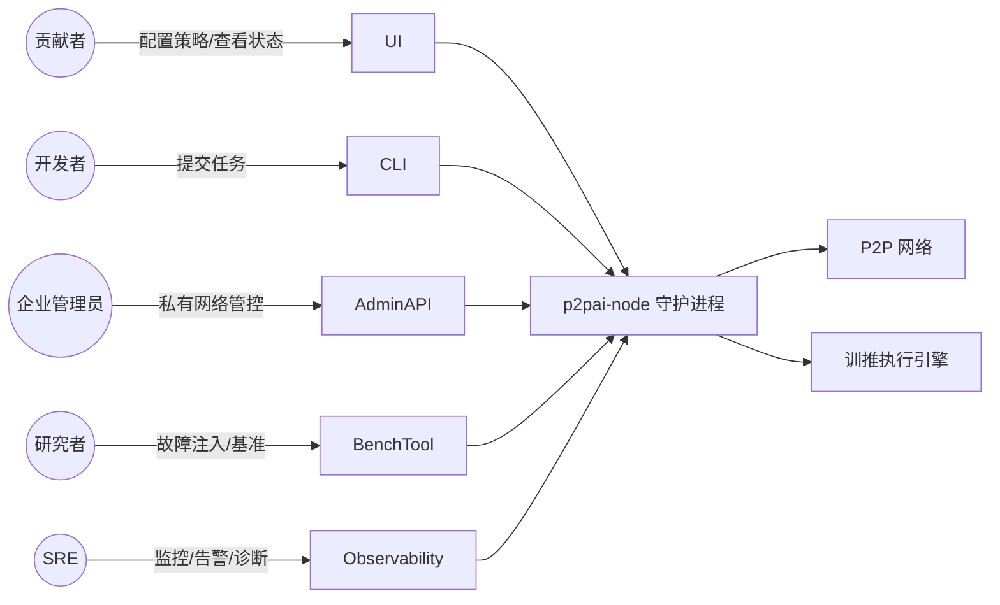

# P2PAI 需求规格说明书（SRS / PRD）

> 配套架构文档：[`README.md`](./README.md)
>
> 本文档使用 RFC 2119 关键字：**MUST / SHOULD / MAY / MUST NOT** 表达需求强度。
> 文档状态：Draft v0.1（与 README 中第 6–11 章共同构成工程交付基线）

---

## 1 文档目的与读者

### 1.1 目的

本文档完整刻画 **P2PAI**（基于 P2P 网络的分布式 AI 推理训练一体化系统）的**业务背景、范围、利益相关方、用户与用例、功能性需求、非功能性需求、接口与数据约束、约束/假设、验收标准、MVP 范围、风险与发布计划**，作为研发、测试、运维、产品、合规等团队的统一交付契约。

### 1.2 目标读者

- 架构师、研发工程师（Rust / Python / 前端）
- 测试与 SRE / 运维团队
- 产品经理与项目管理
- 安全与合规审计
- 早期社区贡献者与生态合作伙伴

### 1.3 术语表

| 术语 | 含义 |
| --- | --- |
| 节点 / Node | 运行 P2PAI 客户端的任一终端 |
| Coordinator | 任务发起节点临时担任的调度主节点 |
| Worker | 参与任务执行的普通节点 |
| Shard | 模型参数分片（按 layer × module × tensor_split 切分） |
| ShardID / CID | 分片的逻辑标识 / 内容寻址标识 |
| S1 / S2 / S3 | 参数三级敏感度（高 / 中 / 低） |
| A / B / C 类 | 节点三级稳定性 |
| LoRA | Low-Rank Adaptation，低秩适配器 |
| D-PSGD | Decentralized Parallel SGD，去中心化并行随机梯度下降 |
| DHT | Distributed Hash Table |
| PVF | Parameter Vulnerability Factor，参数脆弱系数 |
| SLO | Service Level Objective |
| 训推一体 | 推理过程中同步完成参数迭代的单流计算范式 |

---

## 2 业务背景与范围

### 2.1 业务背景

参见 README 第 2 章。简言之：
- 中心化智算成本高、用户隐私差、参数迭代滞后；
- 现有 P2P / 联邦学习方案训推割裂、对动态拓扑与无序参数支持不足；
- 大模型的全息冗余与分形自相似特性，为去中心化随机参数分布下的稳定训推提供理论可行性。

### 2.2 项目范围

#### 2.2.1 In Scope（本期范围）

- 跨平台 P2P 节点客户端（Linux / macOS / Windows，x86_64 + arm64）。
- 单流原生训推一体执行引擎（PyTorch + Streaming LoRA）。
- 基于 libp2p 的 P2P 控制/数据/梯度三平面。
- 资源自治守护进程与用户策略系统。
- 任务发起节点临时充当 Coordinator 的调度子系统。
- S1/S2/S3 三级分级管控与无序参数自适应重组。
- CLI 与桌面 UI（Tray + Web 视图）。
- 度量、日志、可观测性、安全（mTLS/Noise/Ed25519）。
- 公开测试网与一套端到端基准。

#### 2.2.2 Out of Scope（本期不涵盖）

- 经济激励代币 / 链上结算（MAY 在后续版本以可插拔方式接入）。
- 模型市场与版权交易平台。
- 端侧训练用的预训练大模型创建工具链。
- 端到端加密的安全多方计算（MPC），仅提供可选 DP-SGD 与 SecAgg hook。
- 移动端 (iOS / Android) 客户端（仅留接口预留，正式适配在后续版本）。

### 2.3 利益相关方

| 角色 | 关切点 |
| --- | --- |
| 终端用户（贡献者） | 隐私、设备安全、可控资源占用、参与门槛低 |
| 任务发起方（开发者 / 企业） | 推理时延、训练效果、成本、可重复性、合规 |
| 运维 / SRE | 可观测、可诊断、灰度、回滚 |
| 安全 / 合规 | 数据不出域、抗毒化、可审计、密钥管理 |
| 生态合作方 | 协议稳定性、SDK 可用性、互操作 |
| 项目维护者 | 协议演进、社区治理、长期可维护性 |

---

## 3 用户画像与典型用例

### 3.1 用户画像

1. **U1 普通贡献者**：拥有一台闲置 PC 或工作站，希望以可控方式贡献算力。
2. **U2 个人开发者**：使用 P2PAI 在自有数据上做 LoRA 在线微调。
3. **U3 企业内部使用者**：在公司内网部署 P2PAI 私有网络，数据不出企业。
4. **U4 研究者**：基于 P2PAI 做去中心化训推、容错、聚合算法研究。
5. **U5 运维 / SRE**：负责引导节点、监控、安全响应。

### 3.2 关键用户故事（节选）

- **US-01**：作为 **U1**，我希望"用最多 20% CPU、仅 WiFi、晚上 0–7 点参与"，**以便** 不影响白天工作。（→ FR-AUT-01/02）
- **US-02**：作为 **U2**，我希望提交一个微调任务，系统自动找到合适节点并在数小时内给我可用的 LoRA 适配器与可推理服务，**以便** 快速验证想法。（→ FR-SCH-01、FR-RT-02）
- **US-03**：作为 **U3**，我希望全部业务流量在内网，且未授权节点不能加入，**以便** 满足合规。（→ FR-NET-04、NFR-SEC-02）
- **US-04**：作为 **U4**，我希望能注入故障（杀节点、丢分片、毒化梯度）并量化系统表现，**以便** 写论文。（→ FR-OBS-03、NFR-REL-02）
- **US-05**：作为 **U5**，我希望看到全网拓扑、活跃任务、异常告警与一键导出诊断包，**以便** 快速定位问题。（→ FR-OBS-01/02）

### 3.3 顶层用例图

---

## 4 功能性需求（Functional Requirements）

> 编号规则：`FR-<域>-<序号>`。每条需求附**优先级**（P0 必须 / P1 重要 / P2 可选）和**验收依据**。

### 4.1 资源自治层（FR-AUT）

| ID | 优先级 | 需求 | 验收依据 |
| --- | --- | --- | --- |
| FR-AUT-01 | P0 | 系统 **MUST** 周期性（≤ 5 s）采集 CPU/GPU/RAM/带宽/温度/在线时长，生成 NodeProfile | 单元测试 + 跨平台真机测试 |
| FR-AUT-02 | P0 | 系统 **MUST** 提供 TOML 策略文件，支持算力/带宽/任务类型/WiFi-only/静默时段/温度熔断 | E2E：策略变更 ≤ 1 s 生效 |
| FR-AUT-03 | P0 | 用户策略优先级 **MUST** 高于调度策略；冲突时拒绝任务并返回明确原因 | 用例：调度想要 4 核而策略限 2 核，结果应被 `REFUSE` 拒绝 |
| FR-AUT-04 | P0 | **MUST** 通过 cgroups v2 / Windows Job Objects / macOS taskpolicy 强制隔离资源占用 | 故障注入：try-to-overuse 必被截断 |
| FR-AUT-05 | P0 | **MUST** 实现"前台优先"：检测到前台 GPU/重 CPU 进程时自动降级或暂停 | 启动 Blender/游戏后 ≤ 3 s 让出资源 |
| FR-AUT-06 | P1 | **SHOULD** 提供"诊断模式"输出资源占用历史曲线 | UI 可导出 CSV |
| FR-AUT-07 | P1 | **SHOULD** 支持电池模式（笔记本电池供电时降为仅推理或暂停） | macOS/Win 真机 |

### 4.2 P2P 网络层（FR-NET）

| ID | 优先级 | 需求 | 验收依据 |
| --- | --- | --- | --- |
| FR-NET-01 | P0 | **MUST** 基于 libp2p 实现 Kademlia DHT 节点发现、GossipSub 控制消息 | 协议合规测试 |
| FR-NET-02 | P0 | **MUST** 支持 TCP + QUIC，含 hole-punching 与 Circuit Relay v2，全球公网穿透成功率 ≥ 90% | 多地域真机测试 |
| FR-NET-03 | P0 | **MUST** 提供基于 BLAKE3 的分片内容寻址（CID）、多源并行下载、断点续传 | 大文件抓取基准 |
| FR-NET-04 | P0 | **MUST** 支持"私有网络模式"（pre-shared key 网络隔离） | 未授权节点应 DROP |
| FR-NET-05 | P0 | 所有 P2P 连接 **MUST** 使用 Noise XX；身份 **MUST** 为 Ed25519 PeerID | 抓包验证 |
| FR-NET-06 | P0 | **MUST** 遵守用户带宽上限（token-bucket），误差 ≤ ±10% | 速率测试 |
| FR-NET-07 | P1 | **SHOULD** 提供自托管 TURN/Relay 兜底配置 | 私有部署文档 |
| FR-NET-08 | P1 | **SHOULD** 提供反女巫与 peer scoring（GossipSub v1.1） | 故意刷 spam 应被惩罚 |

### 4.3 存储与分片（FR-STO）

| ID | 优先级 | 需求 | 验收依据 |
| --- | --- | --- | --- |
| FR-STO-01 | P0 | **MUST** 提供 ShardStore（RocksDB + 文件 sparse）抽象 | 单测 |
| FR-STO-02 | P0 | **MUST** 落地 ShardMeta（含 sensitivity、version、blake3、pvf_percent） | proto 兼容性测试 |
| FR-STO-03 | P0 | S1 参数 **MUST** 在所有节点本地常驻；缺失时启动自动补全流程 | 启动自检 |
| FR-STO-04 | P0 | **MUST** 实现垃圾回收（按 LRU + 用户配额） | 容量到达上限不应崩溃 |
| FR-STO-05 | P1 | **SHOULD** 支持权重冷热分层（热层 SSD、冷层 HDD） | 配置验证 |

### 4.4 训推执行引擎（FR-RT）

| ID | 优先级 | 需求 | 验收依据 |
| --- | --- | --- | --- |
| FR-RT-01 | P0 | **MUST** 在 PyTorch ≥ 2.3 之上实现单流 Streaming LoRA：forward 中同步完成反传与 ΔW 原地更新 | 单元测试：loss 单调下降 |
| FR-RT-02 | P0 | **MUST** 支持至少 Llama-3-8B-Q4、Qwen2-7B-Q4 两个模型族跑通端到端 | 集成测试 |
| FR-RT-03 | P0 | **MUST** 支持参数分片按 ShardID 加载、按层流水并行 | 多机集成 |
| FR-RT-04 | P0 | **MUST** 实现 D-PSGD 邻居加权聚合，含 staleness 衰减与丢弃阈值 | 收敛回归 |
| FR-RT-05 | P0 | **MUST** 对参数缺失/错误/动态替换提供三类容错路径（见 README §4.4.4.4） | 故障注入测试 |
| FR-RT-06 | P0 | **MUST** 支持热状态接续：群组重组后 ≤ 1 s 无感续跑 | 杀-起测试 |
| FR-RT-07 | P1 | **SHOULD** 支持插件式聚合算法（FedAvg / Krum / Median / TrimmedMean） | 配置切换 |
| FR-RT-08 | P1 | **SHOULD** 支持可选 DP-SGD 噪声与 SecAgg hook | 配置开关 |

### 4.5 调度与任务管理（FR-SCH）

| ID | 优先级 | 需求 | 验收依据 |
| --- | --- | --- | --- |
| FR-SCH-01 | P0 | **MUST** 由任务发起节点临时担任 Coordinator，任务结束自动释放角色 | 状态机测试 |
| FR-SCH-02 | P0 | **MUST** 根据 NodeProfile + TaskSpec 完成动态成组，组员规模符合 SLO | 单元 + 集成 |
| FR-SCH-03 | P0 | **MUST** 进行 ShardInventory 全组盘点并生成 ExecPlan（含降级路径） | 输出可视化 |
| FR-SCH-04 | P0 | **MUST** 监听心跳，超时 **MUST** 触发 EVICT + REBALANCE 且不丢任务 | 故障注入 |
| FR-SCH-05 | P0 | Coordinator **MUST NOT** 中转分片与梯度数据 | 流量验证 |
| FR-SCH-06 | P1 | **SHOULD** 支持任务持久化（WAL）以便 Coordinator 切换 | 杀-起 Coordinator |
| FR-SCH-07 | P1 | **SHOULD** 支持任务优先级与配额（多任务共存） | 调度公平性测试 |

### 4.6 安全（FR-SEC）

| ID | 优先级 | 需求 | 验收依据 |
| --- | --- | --- | --- |
| FR-SEC-01 | P0 | 所有控制消息 **MUST** 由发送方 Ed25519 签名，接收方校验 | 协议测试 |
| FR-SEC-02 | P0 | **MUST** 实现毒化梯度过滤（梯度范数裁剪 + Krum/Median） | 注入恶意梯度 |
| FR-SEC-03 | P0 | 业务原始数据 **MUST NOT** 离开发起节点 | 流量审计 |
| FR-SEC-04 | P1 | **SHOULD** 提供轻量声誉评分系统（本地累计 + 可选共识） | 行为统计 |
| FR-SEC-05 | P1 | **SHOULD** 支持密钥轮换与离线身份导出/导入 | CLI 测试 |

### 4.7 接口与扩展（FR-API）

| ID | 优先级 | 需求 | 验收依据 |
| --- | --- | --- | --- |
| FR-API-01 | P0 | **MUST** 提供 gRPC 本地接口（UDS / 命名管道）：任务提交、状态查询、策略管理 | proto 文档 + 兼容测试 |
| FR-API-02 | P0 | **MUST** 提供 OpenAI 兼容 `/v1/chat/completions` HTTP 接口（仅本地监听） | 兼容性测试 |
| FR-API-03 | P1 | **SHOULD** 提供 Python SDK 与 TypeScript SDK | 示例工程 |
| FR-API-04 | P2 | **MAY** 提供 WASM 沙箱执行用户自定义算子 | 安全沙箱验证 |

### 4.8 用户界面与可观测性（FR-UI / FR-OBS）

| ID | 优先级 | 需求 | 验收依据 |
| --- | --- | --- | --- |
| FR-UI-01 | P0 | **MUST** 提供桌面 Tray + Web UI：当前任务、资源占用、网络状态、策略编辑 | UAT |
| FR-UI-02 | P1 | **SHOULD** 提供拓扑可视化（活跃任务组、Coordinator、分片热度） | UAT |
| FR-OBS-01 | P0 | **MUST** 暴露 Prometheus 指标与 OTel Trace（全链路 trace_id） | 抓取验证 |
| FR-OBS-02 | P0 | **MUST** 本地结构化日志（JSON Lines），支持滚动与脱敏 | 日志审计 |
| FR-OBS-03 | P1 | **SHOULD** 提供基准与故障注入 CLI（`p2pai bench`、`p2pai chaos`） | 基准报告 |

### 4.9 配置与运维（FR-OPS）

| ID | 优先级 | 需求 | 验收依据 |
| --- | --- | --- | --- |
| FR-OPS-01 | P0 | **MUST** 提供单二进制守护进程 + 一键安装包（.pkg/.msi/.deb/.rpm/AppImage/Docker） | 安装测试 |
| FR-OPS-02 | P0 | **MUST** 配置使用 TOML，含 JSON-Schema 校验，启动时校验失败 **MUST** 给出明确错误 | 单元 |
| FR-OPS-03 | P0 | **MUST** 支持热更新策略与日志级别，无需重启 | 运行时切换 |
| FR-OPS-04 | P1 | **SHOULD** 支持自动版本协商与拒绝 < `min_supported_version` 的对端 | 兼容性测试 |
| FR-OPS-05 | P1 | **SHOULD** 提供"诊断包"导出（脱敏） | 一键导出 |

---

## 5 非功能性需求（NFR）

### 5.1 性能（NFR-PERF）

| ID | 需求 |
| --- | --- |
| NFR-PERF-01 | 7B-Q4 模型在 ≥ 8 节点群组下，P50 首 Token ≤ 1.5 s，P95 ≤ 3.5 s |
| NFR-PERF-02 | LoRA 在线微调达到中心化基线 95% 精度，所需 token 数 ≤ 中心化基线 1.5 倍 |
| NFR-PERF-03 | 守护进程空闲态 CPU ≤ 2%，内存 ≤ 300 MB，磁盘 IO ≤ 10 MB/min |
| NFR-PERF-04 | 冷启动至加入网络 ≤ 30 s（不含模型下载） |
| NFR-PERF-05 | 单节点平均上行 ≤ 用户配置上限的 80%，默认上限 2 Mbps |

### 5.2 可靠性 / 可用性（NFR-REL）

| ID | 需求 |
| --- | --- |
| NFR-REL-01 | S1 参数全网可用性 ≥ 99.9% |
| NFR-REL-02 | 任意 20% 节点同时离线，任务不中断、精度损失 ≤ 2% |
| NFR-REL-03 | Coordinator 宕机时任务可在 ≤ 30 s 内由备选发起者接管或安全失败 |
| NFR-REL-04 | MTBF ≥ 30 天（守护进程稳态运行不崩溃） |

### 5.3 安全（NFR-SEC）

| ID | 需求 |
| --- | --- |
| NFR-SEC-01 | 全部线上传输 MUST 加密（Noise XX 或 TLS 1.3） |
| NFR-SEC-02 | 私有网络模式下未授权节点接入成功率 = 0 |
| NFR-SEC-03 | 单节点毒化梯度被拒绝率 ≥ 99% |
| NFR-SEC-04 | 已知 CVE 24 小时内必须有缓解方案或紧急修复计划 |
| NFR-SEC-05 | 第三方安全审计在 GA 前完成且 P0/P1 问题全部修复 |

### 5.4 隐私 / 合规（NFR-PRIV）

| ID | 需求 |
| --- | --- |
| NFR-PRIV-01 | 业务原始数据全程本地处理，禁止上行 |
| NFR-PRIV-02 | 默认遥测匿名化，opt-in 才上报；上报字段集合公开可审计 |
| NFR-PRIV-03 | 提供"仅推理"合规模式，关闭所有梯度上传 |
| NFR-PRIV-04 | 满足 GDPR / 个人信息保护法的"用户可随时退出与数据删除"要求 |

### 5.5 可维护性 / 可移植（NFR-MAINT）

| ID | 需求 |
| --- | --- |
| NFR-MAINT-01 | 代码 PR 必须通过 lint + 单测 + 集成测试 + 协议兼容测试 |
| NFR-MAINT-02 | 跨平台支持：Linux (glibc ≥ 2.28)、macOS ≥ 12、Windows ≥ 10 1809 |
| NFR-MAINT-03 | 关键模块（P2P、调度、聚合、自治）单测覆盖率 ≥ 80%，分支 ≥ 70% |
| NFR-MAINT-04 | 所有架构关键决策必须以 ADR 形式归档 |

### 5.6 可观测性（NFR-OBS）

| ID | 需求 |
| --- | --- |
| NFR-OBS-01 | 任务全链路 trace 串联：发起 → 招募 → 执行 → 聚合 → 收尾 |
| NFR-OBS-02 | 指标采样 ≤ 15 s，本地保留 ≥ 7 天 |

### 5.7 可扩展性（NFR-SCALE）

| ID | 需求 |
| --- | --- |
| NFR-SCALE-01 | 公开测试网应支持 ≥ 10,000 在线节点 |
| NFR-SCALE-02 | 单任务组规模可在 [4, 256] 范围内动态扩缩 |
| NFR-SCALE-03 | 模型族扩展不应需要修改协议层，仅新增 `runtime/` 适配器 |

### 5.8 国际化 / 可达性（NFR-I18N / NFR-A11Y）

| ID | 需求 |
| --- | --- |
| NFR-I18N-01 | UI 至少支持简体中文、英文 |
| NFR-A11Y-01 | UI 满足 WCAG 2.1 AA 主要条款（对比度、键盘可达） |

---

## 6 数据需求

### 6.1 关键数据实体

参见 README §7：`ShardID`, `ShardMeta`, `NodeProfile`, `UserPolicy`, `TaskSpec`, `SLO`, `Group`, `GroupMember`, `ExecPlan`。

### 6.2 数据保留与生命周期

| 数据 | 保留位置 | 默认保留期 | 删除策略 |
| --- | --- | --- | --- |
| 本地业务输入 | 仅内存 | 任务结束清空 | 强制 |
| LoRA ΔW | 本地存储 | 用户配置 | LRU |
| 节点画像 | 本地 + DHT 缓存 | 30 min TTL | TTL |
| 任务 WAL | 本地 | 任务完成 + 24h | 自动清理 |
| 遥测 | 本地 | 7 天 | 滚动 |
| 诊断包 | 用户手动导出 | 不自动保存 | 用户管理 |

### 6.3 备份与恢复

- 节点身份私钥 **MUST** 提供加密导出/导入；丢失即身份永久丧失。
- 本地分片缓存丢失可重建（从 DHT 重新拉取）。

---

## 7 接口需求

### 7.1 对外接口

| 接口 | 协议 | 用途 |
| --- | --- | --- |
| 本地控制 API | gRPC over UDS / Named Pipe | CLI / UI 与守护进程通信 |
| OpenAI 兼容 API | HTTP/1.1 + JSON | 业务接入推理 |
| Prometheus | HTTP `/metrics` | 监控 |
| OTel Exporter | OTLP gRPC | Trace/Metric 导出 |

### 7.2 P2P 协议

| 协议 ID | 用途 |
| --- | --- |
| `/p2pai/control/1.0.0` | 控制消息（RECRUIT/JOIN/EVICT/...） |
| `/p2pai/shard/1.0.0` | 分片拉取 |
| `/p2pai/grad/1.0.0` | 梯度推送 |
| `/p2pai/ping/1.0.0` | 心跳与 RTT 测量 |

兼容策略：SemVer；`MINOR` 向后兼容；`MAJOR` 必须协商。

---

## 8 约束、假设与依赖

### 8.1 技术约束

- 节点最低硬件：x86_64 或 arm64 CPU、4 GB RAM、20 GB 空闲磁盘、可访问公网或预共享私有网络。
- GPU 可选；若无 GPU 仅参与轻量推理与 S3 容错任务。
- 操作系统支持参见 NFR-MAINT-02。

### 8.2 假设

- 大模型族在已选 Transformer 系列上具备充分的全息/分形冗余（与 README §4.3.2 一致）；若未来引入新架构需重新评估 PVF。
- 全网具备足够稳定 A 类节点（≥ 5% 占比）以保证调度健康。
- 用户具备基本网络连通性，可访问至少一个 Bootstrap 节点或私有网络入口。

### 8.3 外部依赖

- Rust 工具链 ≥ 1.78、Python ≥ 3.11、PyTorch ≥ 2.3、libp2p ≥ 0.55、RocksDB ≥ 8.x。
- 构建 CI：GitHub Actions（Linux/macOS/Windows）+ 自托管 GPU runner（集成测试）。
- 公开 Bootstrap 节点：由项目方初期托管 3–5 个。

### 8.4 法规与合规

- 遵守部署所在地数据保护与出口管制法规；
- 不内置任何已知受出口管制的密码学算法；
- 模型与数据集使用须满足其各自许可证。

---

## 9 验收标准与测试策略

### 9.1 总体验收门槛

PR 合入主线必须通过：

1. 编译与跨平台构建；
2. `cargo test` + `pytest` 全部通过，覆盖率达标（NFR-MAINT-03）；
3. 协议兼容性测试（旧客户端 ↔ 新客户端互通）；
4. 关键基准（`benchmarks/`）未回退 > 5%。

### 9.2 关键测试套件

| 套件 | 描述 |
| --- | --- |
| Unit | Rust + Python 单测 |
| Protocol Conformance | 基于 `.proto` 的协议黑盒测试 |
| Multi-node Integration | 用 docker-compose / k3s 起 16+ 节点跑端到端 |
| Chaos / Fault Injection | 随机杀节点、丢分片、注入毒化梯度 |
| Performance Bench | 时延 / 吞吐 / 收敛 / 资源占用 |
| Security Audit | 外部审计 + 内部红队 |
| UX / UAT | 真实用户在 3 平台上跑安装与入网 |

### 9.3 验收用例样例

- **AT-01**：在 9 节点跨地域环境下提交 1 次推理，P95 首 Token ≤ 3.5 s（→ NFR-PERF-01）。
- **AT-02**：训练任务运行中随机杀 20% 节点，任务持续完成且最终精度损失 ≤ 2%（→ NFR-REL-02）。
- **AT-03**：节点策略改为"仅 WiFi + 限 2 Mbps + 仅推理"，1 s 内生效；新分配的训练任务被 REFUSE（→ FR-AUT-03）。
- **AT-04**：注入 10% 节点为毒化攻击者，被拒绝率 ≥ 99%，训练仍收敛（→ NFR-SEC-03）。
- **AT-05**：在企业私有网络模式下，外部节点尝试加入 100 次，成功率 = 0（→ FR-NET-04）。

---

## 10 MVP 与发布范围

### 10.1 MVP（与 README 路线图 M0–M3 对齐）

| 模块 | MVP 范围 |
| --- | --- |
| 训推引擎 | 7B-Q4 单模型族，单流 + Streaming LoRA |
| P2P | DHT + GossipSub + 分片传输；公网穿透 ≥ 80% |
| 调度 | 静态分片 + 简化动态成组（无 EVICT/REBALANCE） |
| 自治 | 基础策略 + cgroups 限制 |
| UI | 仅 CLI + 简单 Tray |
| 安全 | Noise + Ed25519 + 哈希校验；无声誉系统 |
| 监控 | Prometheus 指标 + 本地日志 |
| 部署 | Linux x86_64 + macOS arm64 二进制 |

MVP 不含：完整 S2 流转重组、Krum/Median 防毒化、DP/SecAgg、Web UI、Windows 包、企业私有网络。

### 10.2 Beta（M4–M6）

- 完整三级容错重组、热接续；
- 多模型族（Llama-3 / Qwen2 / Mistral）；
- Web UI 与拓扑可视化；
- 全平台安装包；
- 性能与可靠性指标达标。

### 10.3 GA（M7）

- 公开测试网稳定运行 ≥ 7×24h；
- 第三方安全审计通过；
- 文档、SDK、运维手册齐备；
- 协议冻结至 1.0.0。

---

## 11 风险与决策记录

风险登记表详见 README §11。每条风险在仓库 `docs/risks/Rxx.md` 中维护跟踪状态；
所有架构关键决策以 ADR 形式记录于 `docs/arch/ADR-XXXX-*.md`，模板参考 Michael Nygard ADR。

---

## 12 需求追踪矩阵（节选）

| 业务目标 | 关联用户故事 | 关联功能需求 | 关联 NFR | 验收用例 |
| --- | --- | --- | --- | --- |
| 用户可控参与 | US-01 | FR-AUT-01..05 | NFR-PERF-03/05 | AT-03 |
| 端到端推理可用 | US-02 | FR-RT-01..03, FR-SCH-01..03, FR-API-02 | NFR-PERF-01 | AT-01 |
| 企业私有部署 | US-03 | FR-NET-04 | NFR-SEC-02, NFR-PRIV-01 | AT-05 |
| 强容错 | (基础平台) | FR-RT-05/06, FR-SCH-04 | NFR-REL-01/02 | AT-02 |
| 抗毒化 | (基础平台) | FR-SEC-02 | NFR-SEC-03 | AT-04 |
| 可观测 / 研究友好 | US-04/05 | FR-OBS-01..03 | NFR-OBS-01/02 | 基准报告 |

---

## 13 变更管理

- 本文档版本号 **MUST** 遵循 SemVer：协议或验收门槛级变更升 `MAJOR`。
- 任何对协议 `.proto`、KPI/SLO、关键安全/隐私需求的修改 **MUST** 通过 ADR + RFC 评审。
- 变更生效 **MUST** 同步更新 README §6–11 与本文档第 4–9 章。

---

## 14 附录

### 14.1 文档与代码映射速查

| 需求章节 | 主要代码位置（参考 README §8.1） |
| --- | --- |
| §4.1 资源自治 | `crates/autonomy/` |
| §4.2 P2P 网络 | `crates/p2p/` |
| §4.3 存储 | `crates/storage/` |
| §4.4 训推引擎 | `runtime/p2pai_runtime/` |
| §4.5 调度 | `crates/scheduler/` |
| §4.6 安全 | `crates/p2p/`（传输安全） + `crates/scheduler/`（聚合防御） |
| §4.7 接口 | `crates/cli/`、`runtime/` 暴露的 gRPC/HTTP |
| §4.8 UI / OBS | `ui/`、`crates/telemetry/` |
| §4.9 运维 | `scripts/`、`crates/node/` |

### 14.2 待澄清事项（Open Questions）

- OQ-01：是否在 v1 引入轻量声誉链（基于 CRDT 的本地累计 + 周期共识）？
- OQ-02：是否将 SecAgg 列为 P0（影响隐私强度但带来通信开销）？
- OQ-03：跨组 LoRA ΔW 合并冲突时采用 FedAvg / Slerp / 任务路由化？
- OQ-04：移动端（iOS/Android）功耗模型是否值得在 v2 单独立项？

以上待澄清项 **MUST** 在 GA 前形成 ADR 决议。
